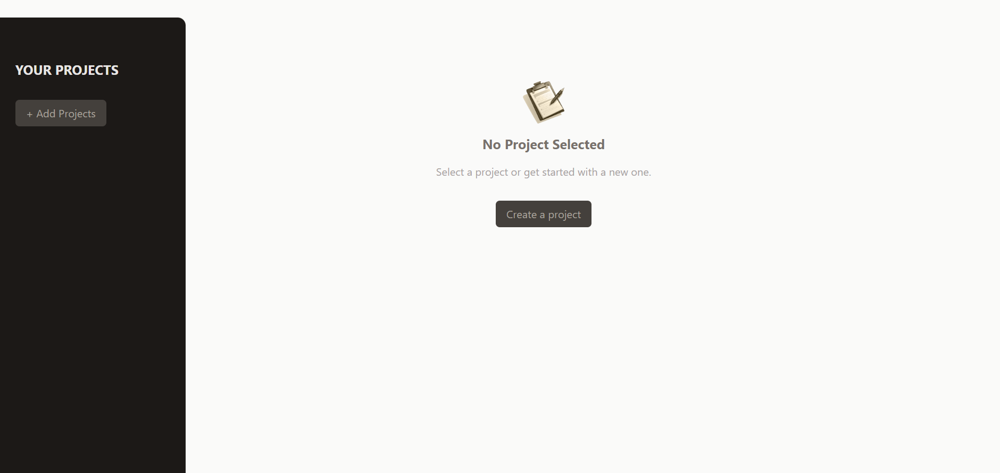
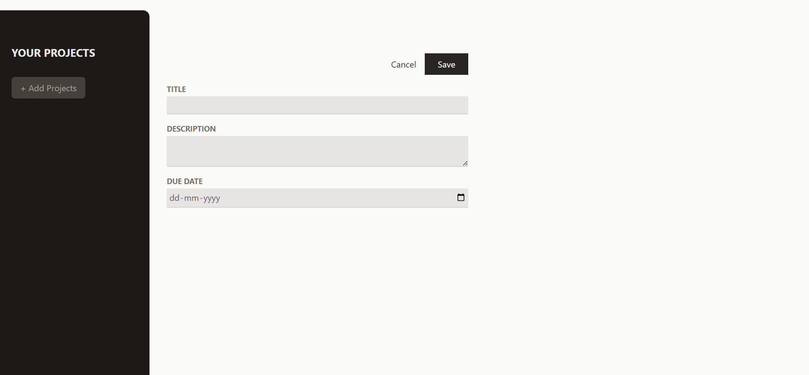
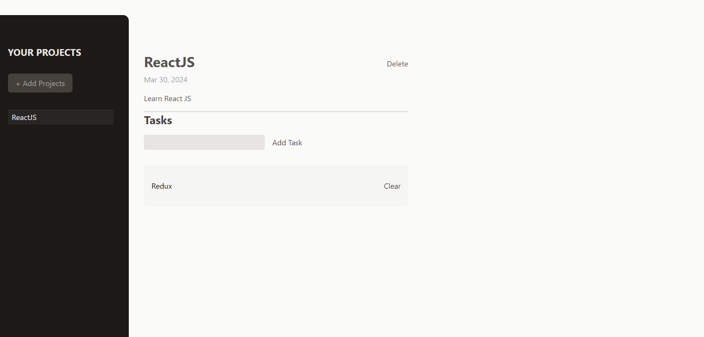

<h1 align="center">React Project Manager</h1>
<p align="center">
    
 </p>

<p align="left">
  Project management app is a web application that helps you keep track of your projects and tasks. With this app, you can create projects, delete projects, add tasks to your projects, edit and delete the tasks.</p>


## Features

- Create new projects
- Delete projects
- Edit existing projects
- View project details
- Create new tasks
- Delete tasks
- Edit existing tasks
- View all tasks associated with a project

## 🛠️ Technologies:

- React
- JavaScript
- CSS3
- HTML5
- Vite

<h2>🚀 Live Demo</h2>

<p>Immerse yourself in its design and functionality with an interactive live demo — simply click the link to explore.</p>

**Live Preview** ➡️ <a href="https://srichandan-09.github.io/project-management/" target="_blank" rel="noopener noreferrer">Demo</a>

<h2>🖼️ Project Screenshots</h2>

<p>Feel free to check out the screenshot of my website for a sneak peek into its captivating user interface.</p>

<p align="center">
  
</p>

<p align="center">
  
</p>

<p align="center">
  
</p>

---

# ✨ How to Get Started

## Clone Project:

```bash

git clone https://github.com/Srichandan-09/project-management.git

```

## Install the Dependencies:

```bash

npm install

```

or in short

```bash

npm i

```

## Launch:

```bash

npm run dev

```

## Author

<b>👤 Srichandan</b>

- LinkedIn - [@Srichandan](https://www.linkedin.com/in/srichandan09)
- Github: [@Srichandan-09](https://github.com/Srichandan-09)

Feel free to contact me with any questions or feedback!

## Show your support

Give a ⭐️ if you liked this project!
